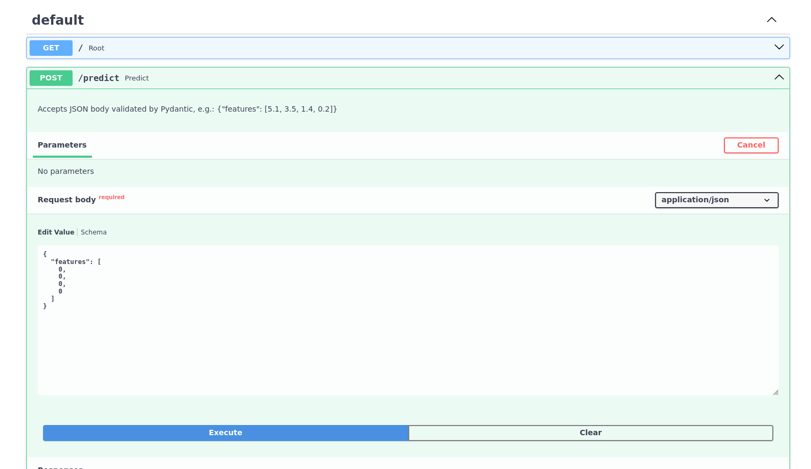
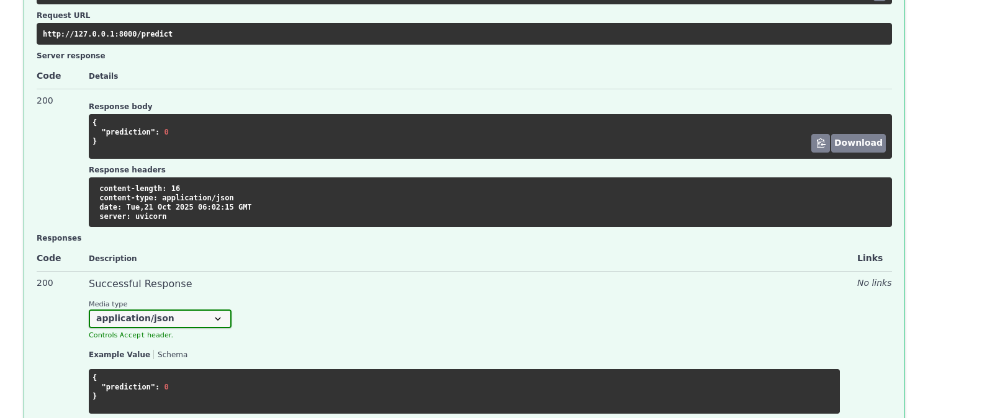

# **Steps to run code**
#### 1. python3 -m venv .venv
#### 2.pip install -r app/requirements.txt
#### 3.source .venv/bin/activate
#### 4.login wandb
#### 5.uvicorn main:app
### 6. go to http://127.0.0.1:8000/docs
### output_screenshort
image-1

image-2

